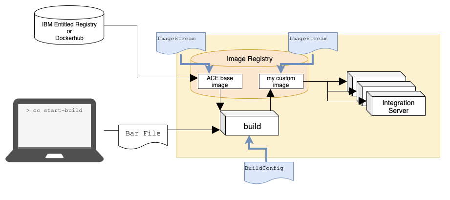

# Creating a custom image for deploying App Connect on OpenShift (CP4I)

This article provides step by step instruction on how to create a custom image for App Connect on OpenShift without the overhead of creating and maintaining a separate image registry.

<br />

When deploying an App Connect integration on OpenShift, you have a choice between uploading the bar file to the App Connect dashboard or "baking it in" to a custom image. 

<br />

There are pros and cons of each of these. Uploading via the dashboard works out of the box and you do not need any additional infrastructure. 

<br />

If you create a baked image, you can automate the whole process and there is no need to use any UI.

Further to this, creating a baked image provides more control over customisation of the container. 

You could add multiple bar files, bar file overrides, user defined extension or third party libraries etc.

<br />
On starting the build, OpenShift will create a `build` pod which pulls the ACE image from either IBM Entitled Registry or from Dockerhub. 

The result of the build is a new image, which extends the ACE image by adding the bar file. 

This new image is published to the image registry on the OpenShift cluster. 

Finally an IntegrationServer is created and each of its pods pulls the custom image from the ImageRegistry to run in its containers.

<br />



<br />


To configure the system, we shall create the following:
* ***Source Image*** We define an ImageStream with an ImageStreamTag with a reference to the App Connect base image.
* ***Build Configuration*** An OpenShift BuildConfig stores the configuration (e.g Dockerfile) necessary to build the custom image.
* ***Target Image*** We define another ImageStream containing an ImageStreamTag with a reference to the resulting custom image.

<br />

## The Solution
Out of the box, OpenShift provides some resources that can be configured to build images and store them in the cluster's own image registry. There are a few build strategies available and different options for triggering and for loading or pulling your code into those builds.

<br />

We are going to use the dockerStrategy and will trigger the build manually from command line.

<br />


Select the project that you want to use 

```
oc project ar-cp4i-ace-demo
```

or create a new project with

```
oc new-app ar-cp4i-ace-demo
```
## Steps

### 1. Setup environment variables
Open a bash terminal and set the environment variable `OPEN_SHIFT_PROJECT` to the name of the OpenShift project that you created for [Prerequisite #2](#Prerequisites) and set `IBM_ENTITLEMENT_KEY` to the value of your IBM entitlement key. NOTE: it is not necessary to set `IBM_ENTITLEMENT_KEY` if you intend to use the developer edition from docker hub.

For example, in your terminal, run the following, replacing `ar-cp4i-ace-demo` with the name of your project and replacing `<your ibm entitlement key>` with your key for the IBM Entitled Registry:

```sh
export OPEN_SHIFT_PROJECT=ar-cp4i-ace-demo
export IBM_ENTITLEMENT_KEY=<your ibm entitlement key>
```

Set Windows PATH variable for the current session:

```cmd
set OPEN_SHIFT_PROJECT=ar-cp4i-ace-demo
set IBM_ENTITLEMENT_KEY=<your ibm entitlement key>
```

<br />

### 2. Create the pull secret for the base image
If you are intending to use the developer edition image, then you may skip this step.

Run the following in the same bash terminal

```sh
oc create secret docker-registry ibm-entitlement-key --docker-username=cp --docker-password=${IBM_ENTITLEMENT_KEY} --docker-server=cp.icr.io
```

### 3. Tag the input image
Run the following in your bash terminal to create an ImageStream:

```sh
oc apply -f - <<EOF
apiVersion: image.openshift.io/v1
kind: ImageStream
metadata:
 name: ace-server-prod
 namespace: ${OPEN_SHIFT_PROJECT}
EOF
```

The name we give here can be anything that you chose but we will use `ace-server-prod` so that it is descriptive of its purpose.

If you are using the developer edition, then it would make sense to change the `name` of the `ImageStream` to `ace-server`

Run the following in your terminal to create an `ImageStreamTag`

```sh
oc tag -n ${OPEN_SHIFT_PROJECT} cp.icr.io/cp/appc/ace-server-prod@sha256:04bc376391a00ff1923d9122f93911b0f8e9700c7dda132f24676e383c0283cc ace-server-prod:latest-amd64
```

This will use release 11.0.0.9-r2 production images. Refer to the [App Connect Knowledge Center](https://www.ibm.com/docs/en/app-connect/containers_cd?topic=obtaining-app-connect-enterprise-server-image-from-cloud-container-registry) for the tags for other releases of the production image and refer to https://hub.docker.com/r/ibmcom/ace-server/tags for the tags relating to the developer edition.

<br />

If this is successful, then it validates that you have performed step 2 correctly.

```sh
oc get ImageStreamTags -n ${OPEN_SHIFT_PROJECT}
```

Should return something like
```sh
NAME                           IMAGE REFERENCE                                                                                             UPDATED


ace-server-prod:latest-amd64   cp.icr.io/cp/appc/ace-server-prod@sha256:04bc376391a00ff1923d9122f93911b0f8e9700c7dda132f24676e383c0283cc   16 seconds ago
```

<br />

### 4. Define the output image stream

Run the following in your terminal to create an ImageStream
```sh
oc apply -f - <<EOF
apiVersion: image.openshift.io/v1
kind: ImageStream
metadata:
 name: my-custom-ace-image
 namespace:   name: ar-ace-app-demo
EOF
```

The name can be anything you chose. You will likely create a new ImageStream for every bar file that you intend to deploy so it would make sense to give a name that makes it easy to associate with the bar file and the purpose of that integration.


### 5. Specify the build configuration
Run the following in your terminal to create the BuildConfig object

```sh
oc apply -f - <<EOF
apiVersion: build.openshift.io/v1
kind: BuildConfig
metadata:
  name: ar-ace-app-demo
  namespace: ace
  labels:
    app: ar-ace-app-demo
spec:
  source:
    type: Git
    git:
      uri: https://github.com/Mduduzi/ar-cp4i-ace-demo.git
    contextDir: .
  strategy:
    type: Docker                      
    dockerStrategy:
      dockerfilePath: Dockerfile    # Look for Dockerfile in: gitUri/contextDir/dockerfilePath
  output:
    to:
      kind: ImageStreamTag
      name: my-custom-ace-image:latest
      namespace: ar-cp4i-ace-demo
EOF
```

NOTE: If you are using developer edition and you changed the name of the ImageStream in step 3, then you need to update the yaml here accordingly.